# Infineon Smart Lock - Touch application (PSoC&trade; 4: MSCLP CAPSENSE&trade;)

<mark style="background-color: orange">*Replace "CY8CKIT-040T" BSP references with "SMARTLOCK_TOUCH"*

<mark style="background-color: orange">*Add support for Arm and IAR compilers, after confirming*

Infineon Smart Lock is a Matter (formerly Project Connected Home over IP, or Project CHIP) enabled electronic lock solution which is designed to perform locking and unlocking operations on a door when it receives such instructions from an authorized device. A user can authorize themselves and control the lock using one of several methods such as a PIN entered using a touch pad, using an NFC tag, or using a mobile app with Bluetooth or Wi-Fi connectivity. 

The remote control of the lock using mobile app utilizes Matter protocol over Wi-Fi. It also monitors access and sends alerts to user for the critical events. 

Infineon products such as MCU (PSoC 6, PSoC 4), Connectivity radio (AIROC 43012), Security (OPTIGA Trust M Matter-Ready), Motor (H- Bridge Motor Driver IFX9201SG), Memory (S25HL512T NOR Flash) are used to build this solution.

A numeric PIN is used to control lock through a 12-key touchpad. By holding a type-4 NFC tag near the lock, user can lock and unlock the Infineon Smart Lock. BLE is used for provisioning Wi-Fi credentials and Wi-Fi is used for local network control over Matter and remote control using AWS cloud connection.

<mark style="background-color: orange">*Add photo of Smart lock kit highlighting the proximity loop and keypad buttons*


## Requirements

- [ModusToolbox&trade; software](https://www.infineon.com/cms/en/design-support/tools/sdk/modustoolbox-software/) software v3.1 or later (tested with v3.1)
- Board support package (BSP) minimum required version: 3.1.0
- Programming language: C
- Associated parts: [PSoC&trade; 4000T]

## Supported toolchains (make variable 'TOOLCHAIN')

- GNU Arm&reg; Embedded Compiler v10.3.1 (`GCC_ARM`) - Default value of `TOOLCHAIN`
- Arm&reg; Compiler v6.16 (`ARM`)
- IAR C/C++ Compiler v9.30.1 (`IAR`)

## Supported kits (make variable 'TARGET')

- [SmartLock Reference Kit with PSoC&trade; 4000T](https://www.infineon.com/) (`SMARTLOCK_TOUCH`) - Default value of `TARGET`

## Hardware setup

This reference application uses the board's default configuration. See the kit user guide to ensure that the board is configured correctly.

## Software setup

This reference application requires SmartLock mobile application for Matter provisioning and door lock operation. See the kit user guide for the steps to setup and use the mobile application.

## Using the reference application

<mark style="background-color: orange">*TODO: replace this section with instructions to use Import existing application in-place" option from quick panel.*

Create the project and open it using one of the following:

<details><summary><b>In Eclipse IDE for ModusToolbox&trade;</b></summary>

1. Click the **New Application** link in the **Quick Panel** (or, use **File** > **New** > **ModusToolbox&trade; Application**). This launches the [Project Creator](https://www.infineon.com/ModusToolboxProjectCreator) tool.

2. Pick a kit supported by the code example from the list shown in the **Project Creator - Choose Board Support Package (BSP)** dialog.

   When you select a supported kit, the example is reconfigured automatically to work with the kit. To work with a different supported kit later, use the [Library Manager](https://www.infineon.com/dgdl/Infineon-ModusToolbox_Library_Manager_2.0_User_Guide-UserManual-v01_00-EN.pdf?fileId=8ac78c8c8386267f0183a960c5945992) to choose the BSP for the supported kit. You can use the Library Manager to select or update the BSP and firmware libraries used in this application. To access the Library Manager, click the link from the **Quick Panel**.

   You can also just start the application creation process again and select a different kit.

   To use the application for a kit not listed here, you may need to update the source files. If the kit does not have the required resources, the application may not work.

3. In the **Project Creator - Select Application** dialog, choose the example by enabling the checkbox.

4. (Optional) Change the suggested **New Application Name**.

5. The **Application(s) Root Path** defaults to the Eclipse workspace which is usually the desired location for the application. If you want to store the application in a different location, you can change the *Application(s) Root Path* value. Applications that share libraries must be in the same root path.

6. Click **Create** to complete the application creation process.

For more details, see the [Eclipse IDE for ModusToolbox&trade; user guide](https://www.infineon.com/MTBEclipseIDEUserGuide) (locally available at *{ModusToolbox&trade; install directory}/docs_{version}/mt_ide_user_guide.pdf*).

</details>

<details><summary><b>In command-line interface (CLI)</b></summary>

ModusToolbox&trade; provides the Project Creator as both a GUI tool and the command-line tool (*project-creator-cli*). The CLI tool can be used to create applications from a CLI terminal or from within batch files or shell scripts. This tool is available in the *{ModusToolbox&trade; install directory}/tools_{version}/project-creator/* directory.

Use a CLI terminal to invoke the "project-creator-cli" tool. On Windows, use the command-line "modus-shell" program provided in the ModusToolbox&trade; installation instead of a standard Windows command-line application. This shell provides access to all ModusToolbox&trade; tools. You can access it by typing `modus-shell` in the search box in the Windows menu. In Linux and macOS, you can use any terminal application.

The "project-creator-cli" tool has the following arguments:

Argument | Description | Required/optional
---------|-------------|-----------
`--board-id` | Defined in the `<id>` field of the [BSP](https://github.com/Infineon?q=bsp-manifest&type=&language=&sort=) manifest | Required
`--app-id`   | Defined in the `<id>` field of the [CE](https://github.com/Infineon?q=ce-manifest&type=&language=&sort=) manifest | Required
`--target-dir`| Specify the directory in which the application is to be created if you prefer not to use the default current working directory | Optional
`--user-app-name`| Specify the name of the application if you prefer to have a name other than the example's default name | Optional
<br>

The following example clones the "[PSoC&trade; 4: MSCLP CAPSENSE&trade; low-power proximity tuning](https://github.com/Infineon/mtb-example-psoc4-msclp-capsense-lp-proximity)" application with the desired name "CAPSENSE_Low_Power_Proximity_Tuning" configured for the *CY8CKIT-040T* BSP into the specified working directory, *C:/mtb_projects*:

   ```
   project-creator-cli --board-id CY8CKIT-040T --app-id mtb-example-psoc4-msclp-capsense-lp-proximity --user-app-name CAPSENSE_Low_Power_Proximity_Tuning --target-dir "C:/mtb_projects"
   ```

> **Note:** The project-creator-cli tool uses the `git clone` and `make getlibs` commands to fetch the repository and import the required libraries. For details, see the "Project creator tools" section of the [ModusToolbox&trade; user guide](https://www.infineon.com/ModusToolboxUserGuide) (locally available at *{ModusToolbox&trade; install directory}/docs_{version}/mtb_user_guide.pdf*).

To work with a different supported kit later, use the [Library Manager](https://www.infineon.com/ModusToolboxLibraryManager) to choose the BSP for the supported kit. You can invoke the Library Manager GUI tool from the terminal by using the `make library-manager` command or use the Library Manager CLI tool (library-manager-cli) to change the BSP.

The "library-manager-cli" tool has the following arguments:

Argument | Description | Required/optional
---------|-------------|-----------
`--add-bsp-name` | Name of the BSP that should be added to the application | Required
`--set-active-bsp` | Name of the BSP that should be as active BSP for the application | Required
`--add-bsp-version`| Specify the version of the BSP that should be added to the application if you do not wish to use the latest from manifest | Optional
`--add-bsp-location`| Specify the location of the BSP (local/shared) if you prefer to add the BSP in a shared path | Optional

<br>

The following example adds the CY8CKIT-040T BSP to the already created application and makes it the active BSP for the application:

   ```
   library-manager-cli --project "C:/mtb_projects/CAPSENSE_Low_Power_Proximity_Tuning" --add-bsp-name CY8CKIT-040T --add-bsp-version "latest-v4.X" --add-bsp-location "local"

   library-manager-cli --project "C:/mtb_projects/CAPSENSE_Low_Power_Proximity_Tuning" --set-active-bsp APP_CY8CKIT-040T
   ```

</details>

<details><summary><b>In third-party IDEs</b></summary>

Use one of the following options:

- **Use the standalone [Project Creator](https://www.infineon.com/ModusToolboxProjectCreator) tool:**

   1. Launch Project Creator from the Windows Start menu or from *{ModusToolbox&trade; install directory}/tools_{version}/project-creator/project-creator.exe*.

   2. In the initial **Choose Board Support Package** screen, select the BSP, and click **Next**.

   3. In the **Select Application** screen, select the appropriate IDE from the **Target IDE** drop-down menu.

   4. Click **Create** and follow the instructions printed in the bottom pane to import or open the exported project in the respective IDE.

<br>

- **Use command-line interface (CLI):**

   1. Follow the instructions from the **In command-line interface (CLI)** section to create the application, and then import the libraries using the `make getlibs` command.

   2. Export the application to a supported IDE using the `make <ide>` command.

   3. Follow the instructions displayed in the terminal to create or import the application as an IDE project.

For a list of supported IDEs and more details, see the "Exporting to IDEs" section of the [ModusToolbox&trade; user guide](https://www.infineon.com/ModusToolboxUserGuide) (locally available at *{ModusToolbox&trade; install directory}/docs_{version}/mtb_user_guide.pdf*).

</details>

The project already has the necessary settings by default, so you can go to [Operation](#operation) to test the example. To understand the tuning process and follow the stages for this kit or your own board, go to [Tuning procedure](#tuning-procedure) and then test it using [Operation](#operation).

<br>

## Operation

1. Power the board, using one of the following methods 
   
   a.	USB power source: Connect the provided custom USB cable to the power connector. Connect the other end of the cable to a USB port providing 5V power source, like a laptop USB port.
   
   <mark style="background-color: orange">*Update with better photos*

   **Figure 1. Connecting the Smart Lock kit to a PC**
   
   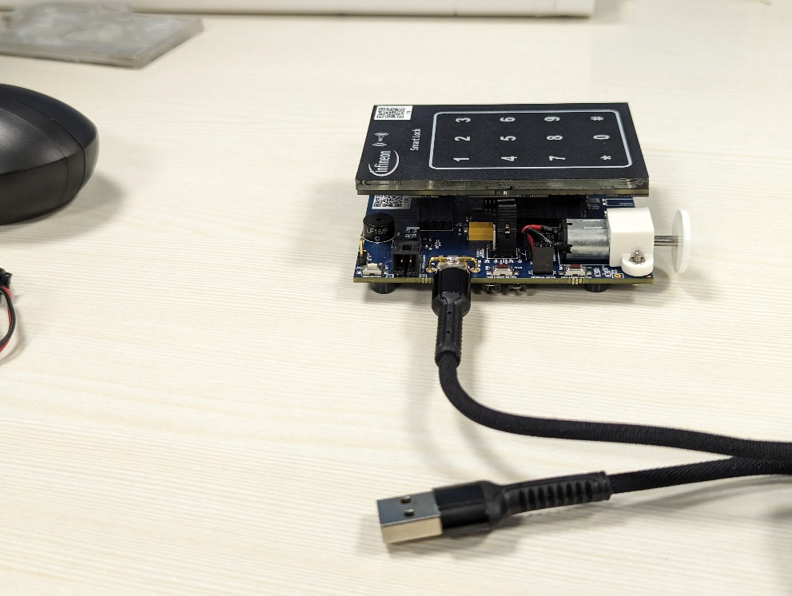
   
   <br>
   
   b.	AA batteries: Use the AA battery holder to power the PCB using 4 x AA alkaline batteries.

   **Figure 2. Connecting the Smart Lock kit to Battery**
   
   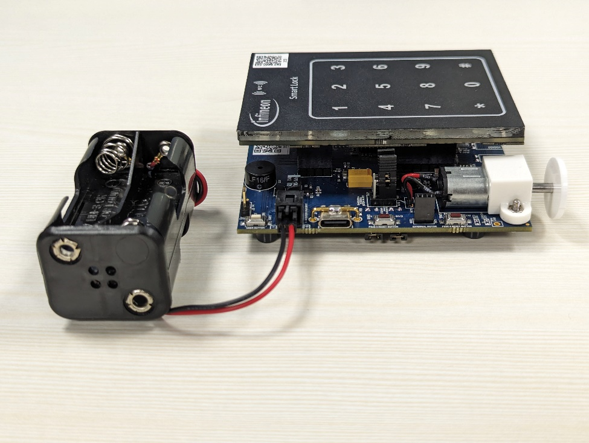
   
   <br>

   ****Note**: Do NOT connect both power sources at the same time.**
   
2. Program the board using one of the following:

   <details><summary><b>Using Eclipse IDE for ModusToolbox&trade;</b></summary>

      1. Select the application project in the Project Explorer.

      2. In the **Quick Panel**, scroll down, and click **\<Application Name> Program (KitProg3_MiniProg4)**.
   </details>

   <details><summary><b>Using CLI</b></summary>

     From the terminal, execute the `make program` command to build and program the application using the default toolchain to the default target. The target and the toolchain are specified manually.
      ```
      make program TARGET=<BSP> TOOLCHAIN=<toolchain>
      ```

      Example:
      ```
      make program TARGET=CY8CKIT-040T TOOLCHAIN=GCC_ARM
      ```
   </details>

3. After programming, the application starts automatically.

4. On powering up, the lock emits a beep from the buzzer and performs a ‘lock’ operation by turning the motor. The keypad’s LED backlight (henceforth refered to as just ‘LEDs’) briefly turn on to illuminate the keypad. 
   
5. To test the application, hover your hand on top of the CAPSENSE&trade; proximity sensor and notice that LED's turns ON with **RED** color to indicate that the hand is in proximity with the keypad. The proximity sensor can sense the hand upto approximately 4cm. When the hand is moved away from the keypad, the LED turns OFF after a brief delay. 


   **Figure 3. LED's turns RED upon hovering the hand on top of the sensor**

   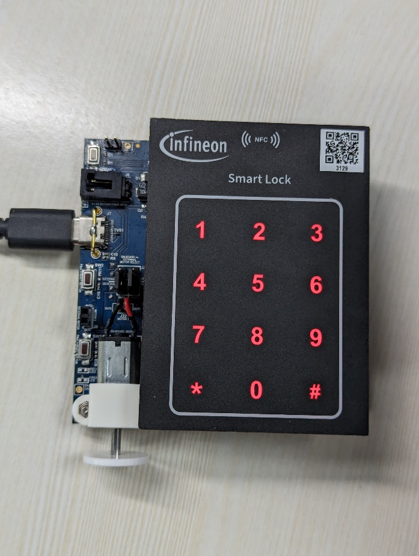

   <br>
6. Use the capacitive touch enabled keypad to enter the default PIN 123456#, and observe the lock emits two beeps (short followed by a long beep) along with 3 GREEN LED blinks and turns the motor to unlock the door. The LED's will now show **GREEN** color when proximity is active.
   
   **Figure 3. LED's blink GREEN when door unlocked**

   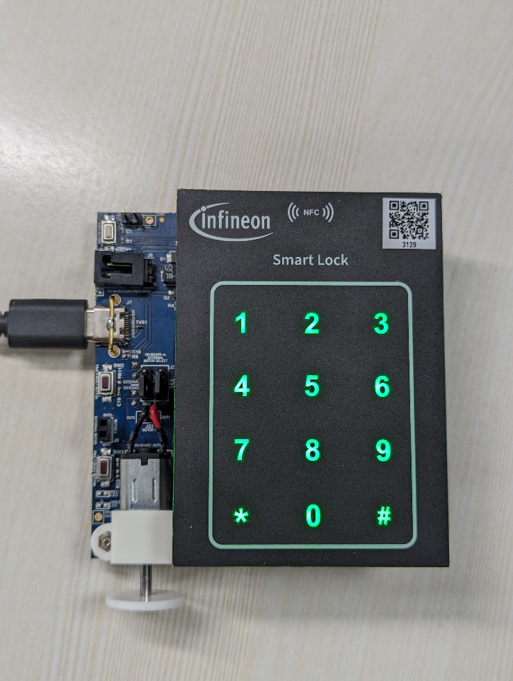

   <br>
7. The lock also supports an “auto re-lock” feature, where if the lock is left idle in unlocked state for ~20 seconds, it automatically re-locks itself. Alternately the door can be locked again using the capacitive touch enabled keypad to enter the default PIN 123456, and observe the lock emits one long beep along with 3 RED LED blinks and turns the motor to lock the door. 
   
   **Figure 3. LED's blink RED when door locked**

   

   <br>

   **Note:** The default PIN 123456 can be changed using the mobile app menu’s “Personalize Keypad PIN” option. The PIN is remembered over power cycles.

   **Note:** Please refer to the userguide for more details on using the SmartLock with mobile app and using NFC card for unlocking.

   <br>
   
   **Table 1. LED Indications for proximity and lock/unlock events**

    Scenario  | LED Color  | LED Pattern
   :------------------| :-----| :-----|
    Hand in proximity  | RED when locked, GREEN when unlocked | ON and fade OFF |
    Lock  | RED | Blink 3 times |
    UnLock  | GREEN | Blink 3 times |

   <br>
### Monitor data using CAPSENSE&trade; Tuner

<mark style="background-color: orange">*Add sentence on why tuner is needed - visualize CapSense sensors data on Tuner UI application, view and update CapSense parameters to visualize changes. (check Tuner user guide for this kind of text)*

<mark style="background-color: orange">*Move tuner section to after the implementation description, as we need to introduce power states like ALR, WOT first* 

1. Open CAPSENSE&trade; Tuner from the 'BSP Configurators' section in the IDE **Quick Panel**.

   You can also run the CAPSENSE&trade; Tuner application standalone from *{ModusToolbox&trade; install directory}/ModusToolbox&trade;/tools_{version}/capsense-configurator/capsense-tuner*. In this case, after opening the application, select **File** > **Open** and open the *design.cycapsense* file of the respective application, which is present in the *{Application root directory}/bsps/TARGET_APP_\<BSP-NAME>/COMPONENT_BSP_DESIGN_MODUS/* folder.

   See the [ModusToolbox&trade; user guide](https://www.infineon.com/ModusToolboxUserGuide) (locally available at *{ModusToolbox&trade; install directory}/docs_{version}/mtb_user_guide.pdf*)for options to open the CAPSENSE&trade; tuner application using the CLI.

2. Ensure that the kit is in CMSIS-DAP Bulk mode (KitProg3 Status LED is ON and not blinking). See [Firmware-loader](https://github.com/Infineon/Firmware-loader) to learn how to update the firmware and switch modes in KitProg3.

3. In the tuner application, click on the **Tuner communication setup** icon or select **Tools** > **Tuner communication setup**. In the window that appears, select the I2C checkbox under KitProg3 and configure it as follows:

   - **I2C address:** 8
   - **Sub-address:** 2 bytes
   - **Speed (kHz):** 400

   These are the same values set in the EZI2C resource.

   **Figure 3. Tuner communication setup parameters**

   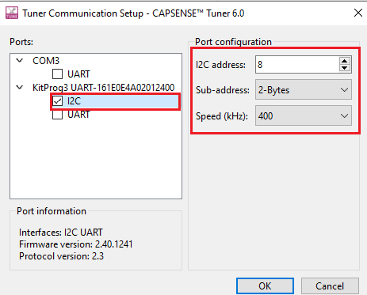

4. Click **Connect** or select **Communication** > **Connect** to establish a connection.

   **Figure 4. Establish connection**

   

5. Click **Start** or select **Communication** > **Start** to start data streaming from the device.

   **Figure 5. Start tuner communication**

   

   The **Widget/Sensor Parameters** tab is updated with the parameters configured in the CAPSENSE&trade; Configurator window. The tuner displays the data from the sensor in the **Widget View** and **Graph View** tabs.

6. Set the **Read mode** to **Synchronized mode**. Navigate to the **Widget view** tab and notice that the **Proximity0** widget is highlighted in blue when you touch it.

   **Figure 6. Widget view of the CAPSENSE&trade; Tuner**

   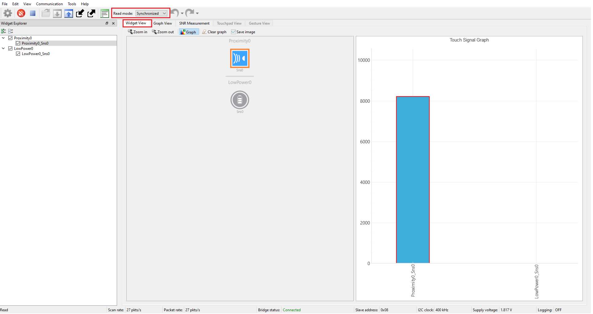

7. Go to the **Graph View** tab to view the raw count, baseline, difference count, and status for each sensor. Observe that the low-power widget sensor's (**LowPower0_Sns0**) raw count is plotted once the device completes a full-frame scan (or detects a touch) in **WOT** mode and moves to **Active/ALR** mode.

   **Figure 7. Graph view of the CAPSENSE&trade; Tuner**

   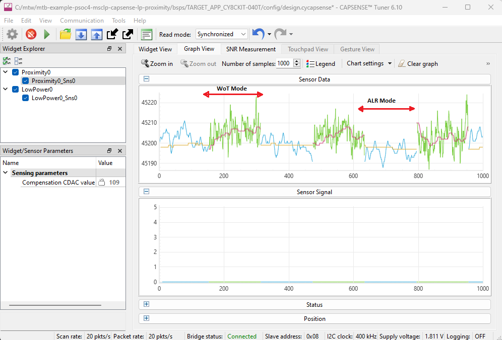

8. See the **Widget/Sensor parameters** section in the CAPSENSE&trade; Tuner window as shown in **Figure 7**.

9. Switch to the **SNR Measurement** tab for measuring the SNR and verify that the SNR is above 5:1 and the signal count is above 50; select the **Proximity0** and **Proximity0_Sns0** sensors, and then click **Acquire noise** as follows:

    **Figure 8. CAPSENSE&trade; Tuner - SNR measurement: Acquire noise**

    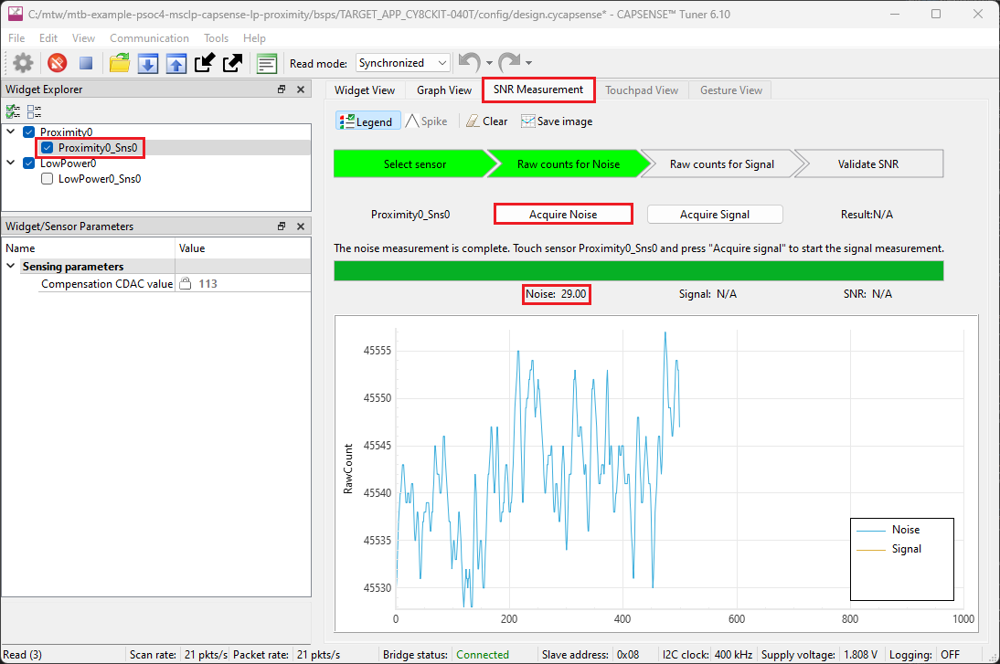

      **Note:** Because the scan refresh rate is lower in **ALR** mode, it takes more time to acquire noise. Touch the CAPSENSE&trade; proximity loop once before clicking **Acquire noise** to transition the device to **ACTIVE** mode to complete the measurement faster.

10. Once noise is acquired, bring your hand near the proximity loop at a distance of around **35 mm** above it and then click **Acquire signal**. Ensure that the hand remains above the proximity loop as long as the signal acquisition is in progress. Observe that the SNR is above 5:1 and the signal count is above 50. If not, repeat signal acquisition by lowering the hand, and thus getting a higher signal.

    The maximum distance the proximity loop can sense is when the SNR is greater than 5:1 for a particular configuration. In the [Tuning procedure](#tuning-procedure) section, you can understand how changing the configuration affects the distance and SNR.

    The calculated SNR on this proximity widget is displayed, as Figure 9 shows.

    **Figure 9. CAPSENSE&trade; Tuner - SNR measurement: acquire signal**

    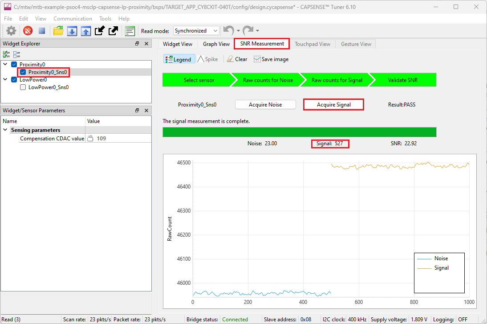

11. To measure the SNR of the low-power sensor (**LowPower0_Sns0**), set the **Finger threshold** to maximum (65535) in **Widget/Sensor Parameters** for the **LowPower0** widget as shown in Figure 12. And set the Proximity threshold and Proximity Touch Threshold to their maximum (65535) values in the Widget/Sensor Parameters of the Proximity0 widget, as shown in Figure 13.

    This is required to keep the application in Low Power mode. Otherwise, the application will stop scanning the low-power sensor when there is a proximity or touch detected and will transition to active mode. 

      **Figure 10. CAPSENSE&trade; update finger threshold**

      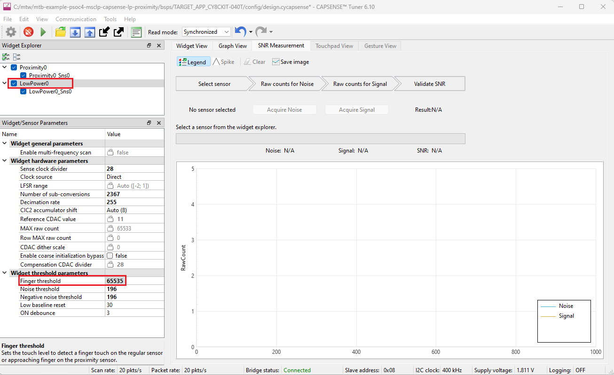
      <br>

      **Figure 11. CAPSENSE&trade; update proximity and touch threshold**

      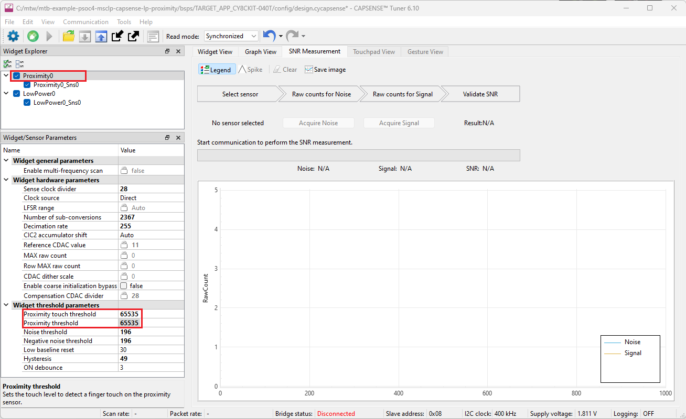

      <br>

12. Repeat steps 9 and 10 to observe the SNR and signal, as shown in Figure 9.

       **Figure 12. CAPSENSE&trade; Tuner - SNR measurement: low-power widget**

       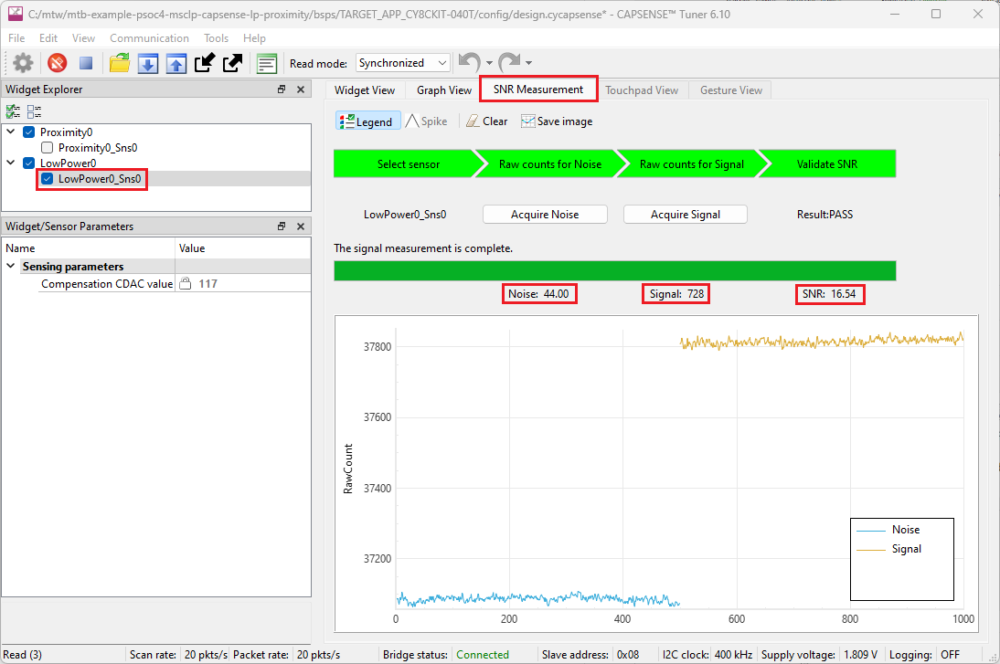


### Current consumption

Follow the instructions in the **Measure current at different power modes** section of the code example [PSoC™ 4: MSCLP CAPSENSE™ low power](https://github.com/Infineon/mtb-example-psoc4-msclp-capsense-low-power) to measure the current consumption.


## Tuning procedure


<details><summary><b> Create custom BSP for your board </b></summary>

1. Create a custom BSP for your board having any device, by following the steps given in [ModusToolbox™ BSP Assistant user guide](https://www.infineon.com/dgdl/Infineon-ModusToolbox_BSP_Assistant_1.0_User_Guide-UserManual-v02_00-EN.pdf?fileId=8ac78c8c8386267f0183a972f45c59af). This code example was created for the device "CY8C4046LQI-T452".

2. Open the *design.modus* file from the *{Application root directory}/bsps/TARGET_APP_\<BSP-NAME>/config/* folder obtained in the previous step and enable CAPSENSE&trade; to get the *design.cycapsense* file. CAPSENSE&trade; configuration can then be started from scratch as explained below.


</details>

The following steps explain the tuning procedure for the proximity loop and the low-power widget.

**Note:** See the section "Manual Tuning" in the [AN92239 - Proximity sensing with CAPSENSE&trade;](http://www.cypress.com/documentation/application-notes/an92239-proximity-sensing-capsense) to learn about the considerations for selecting each parameter values. In addition, see the "Low-power widget parameters" section in the [Achieving lowest-power capacitive sensing with PSoC&trade; 4000T](https://www.infineon.com/002-34231) to learn about the considerations for parameter values specific to low-power widgets.

The tuning flow of the proximity widget is shown in **Figure 13**.

**Figure 13. Proximity widget Tuning flow**

   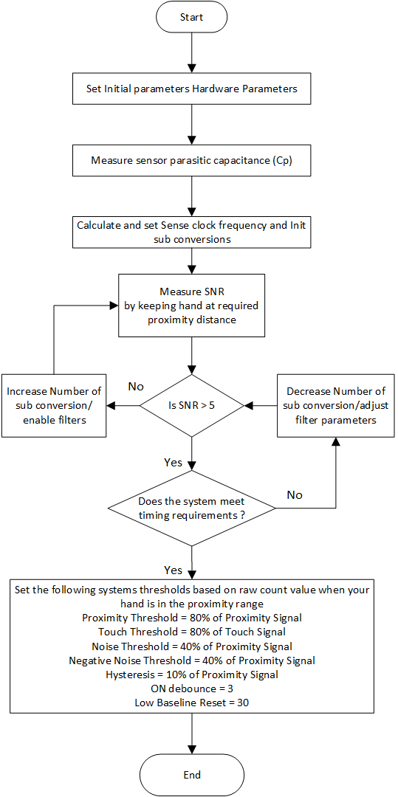

To tune the low-power widget, see the **Tuning flow** section of the code example [PSoC™ 4: MSCLP CAPSENSE™ low power](https://github.com/Infineon/mtb-example-psoc4-msclp-capsense-low-power).

Do the following to tune the proximity widget:

- [Stage 1: Set initial hardware parameters](#stage-1-set-initial-hardware-parameters)

- [Stage 2: Measure Sensor Capacitance and set CDAC Dither parameter](#stage-2-measure-sensor-capacitance-and-set-cdac-dither-parameter)

- [Stage 3: Set sense clock frequency](#stage-3-set-sense-clock-frequency)

- [Stage 4: Fine-tune for required SNR, power, and refresh rate](#stage-4-fine-tune-for-required-snr-power-and-refresh-rate)

- [Stage 5: Tune threshold parameters](#stage-5-tune-threshold-parameters)

### Stage 1: Set initial hardware parameters
-------------------------

1. Connect the board to your PC using the provided USB cable through the KitProg3 USB connector.

2. Launch the Device Configurator tool.

   You can launch the Device Configurator in Eclipse IDE for ModusToolbox&trade; from the **Tools** section in the IDE Quick Panel or in standalone mode from *{ModusToolbox&trade; install directory}/ModusToolbox&trade;/tools_{version}/device-configurator/device-configurator*. In this case, after opening the application, select **File** > **Open** and open the *design.modus* file of the respective application, which is present in the *{Application root directory}/bsps/TARGET_APP_\<BSP-NAME>/COMPONENT_BSP_DESIGN_MODUS* folder.

3. Enable CAPSENSE&trade; channel in Device Configurator as follows:

   **Figure 14. Enable CAPSENSE&trade; in Device Configurator**

   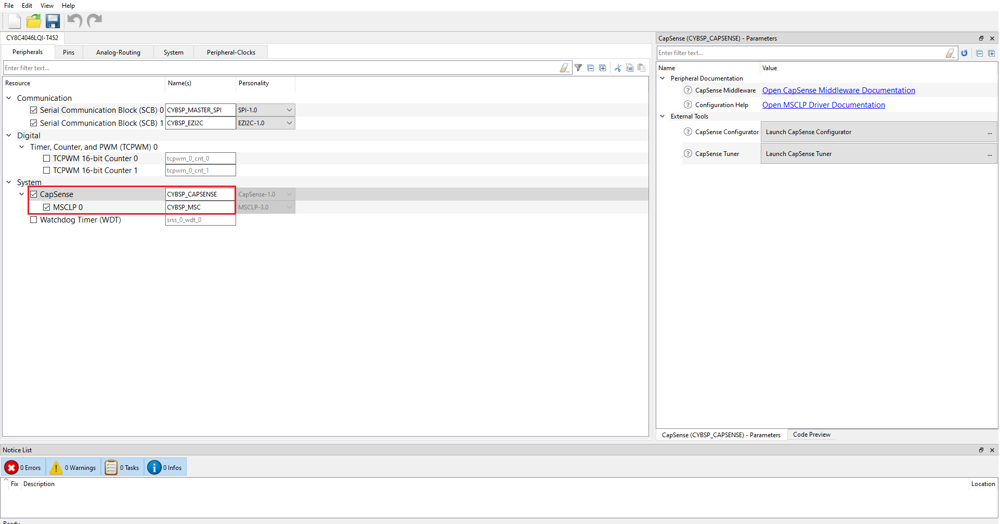

   Save the changes and close the window.

4. Launch the CAPSENSE&trade; Configurator tool.

   You can launch the CAPSENSE&trade; Configurator tool in Eclipse IDE for ModusToolbox&trade; from the "CAPSENSE&trade;" peripheral setting in the Device Configurator or directly from the Tools section in the IDE Quick Panel.

   You can also launch it in standalone mode from *{ModusToolbox&trade; install directory}/ModusToolbox&trade;/tools_{version}/capsense-configurator/capsense-configurator*. In this case, after opening the application, select **File** > **Open** and open the *design.cycapsense* file of the respective application, which is present in the *{Application root directory}/bsps/TARGET_APP_\<BSP-NAME>/COMPONENT_BSP_DESIGN_MODUS* folder.

   See the [ModusToolbox&trade; CAPSENSE&trade; Configurator tool guide](https://www.infineon.com/ModusToolboxCapSenseConfig) for step-by-step instructions on how to configure and launch CAPSENSE&trade; in ModusToolbox&trade;.

5. In the **Basic** tab, add a proximity widget 'Proximity0' and a low-power widget 'LowPower0'. Set their sensing mode as CSD RM (self-cap) and set the CSD tuning mode as *Manual tuning*.

   **Figure 15. CAPSENSE&trade; Configurator - Basic tab**

   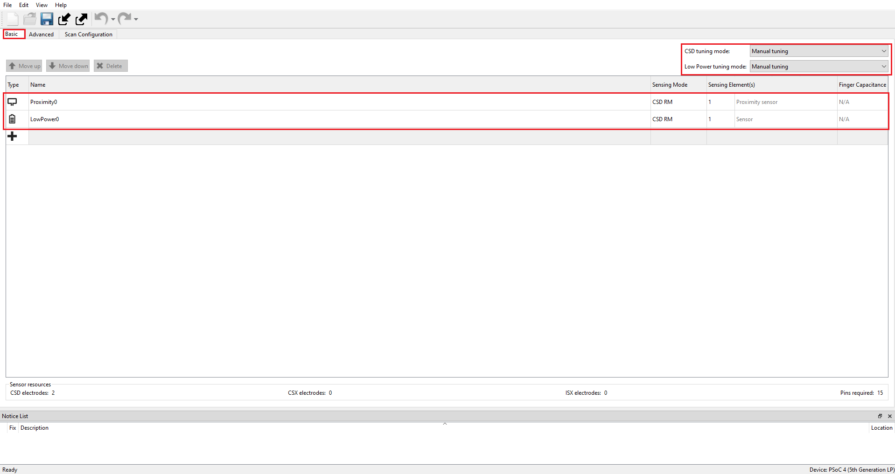

6. Do the following in the **General** tab under the **Advanced** tab:

   1. Select **CAPSENSE&trade; IMO Clock frequency** as **46 MHz**.

   2. Set the **Modulator clock divider** to **2** to obtain the optimum modulator clock frequency. 

   3. Set the **Number of init sub-conversions** based on the hint shown when you hover over the edit box. Retain the default value (which will be set in [Stage 3: Set sense clock frequency](#stage-3-set-sense-clock-frequency)).

   4. Use **Wake-on-Touch settings** to set the refresh rate and frame timeout while in the lowest power mode (Wake-on-Touch mode).

   5. Set **Wake-on-Touch scan interval (ms)** based on the required low-power state scan refresh rate. For example, to get a 16-Hz refresh rate, set the value to **63**.

   6. Set the **Number of frames in Wake-on-Touch** as the maximum number of frames to be scanned in WoT mode if there is no touch detected. This determines the maximum time the device will be kept in the lowest-power mode if there is no user activity. The maximum time can be calculated by multiplying this parameter with the **Wake-on-Touch scan interval (ms)** value.

      For example, to get 10 seconds as the maximum time in WoT mode, set **Number of frames in Wake-on-Touch** to **160** for the scan interval set as 63 ms.

      **Note:** For tuning low-power widgets, **Number of frames in Wake-on-Touch** must be less than the  **Maximum number of raw counts in SRAM** based on the number of sensors in WoT mode as follows:

      **Table 2. Maximum number of raw counts in SRAM**

       Number of low <br> power widgets  | Maximum number of <br> raw counts in SRAM  |
      :---------------------| :-----|
       1  | 245 |
       2  | 117 |
       3  | 74 |
       4  | 53 |
       5  | 40 |
       6  | 31 |
       7  | 25 |
       8  | 21 |

   7. Retain the default settings for all regular and low-power widget filters. You can enable or update the filters later, depending on the signal-to-noise ratio (SNR) requirements in [Stage 4: Fine-tune for required SNR, power, and refresh rate](#stage-4-fine-tune-for-required-snr-power-and-refresh-rate).

      Filters are used to reduce the peak-to-peak noise; however, using filters will result in a higher scan time.

      **Figure 16. CAPSENSE&trade; Configurator - General settings**

      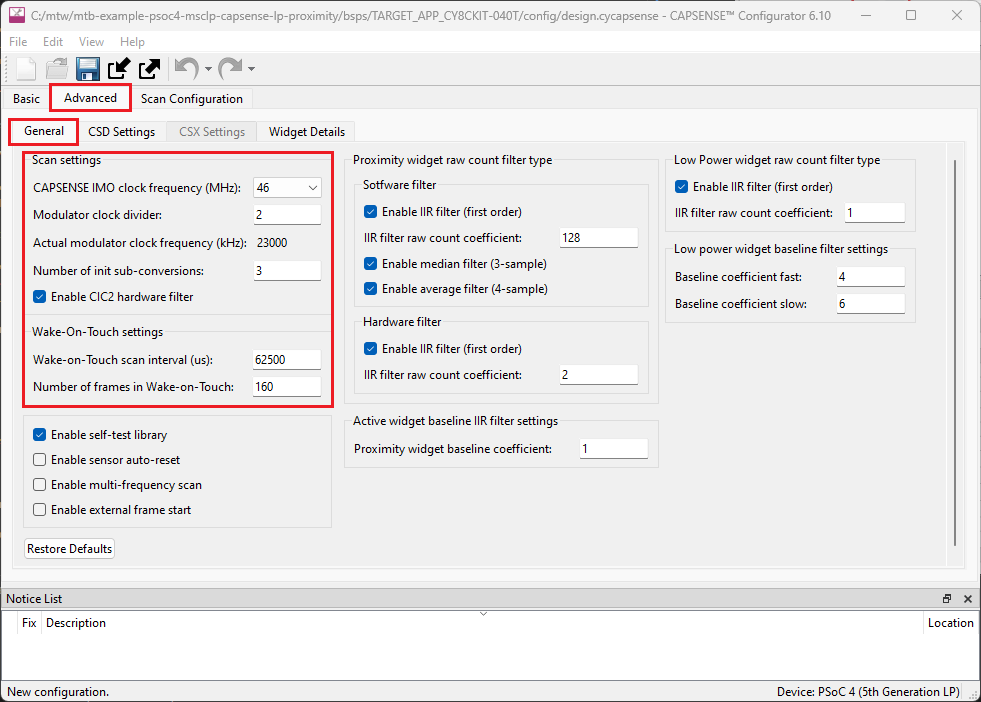

      **Note:** Each tab has a **Restore Defaults** button to restore the parameters of that tab to their default values.

7. Go to the **CSD settings** tab and make the following changes:

   1. Set **Inactive sensor connection** as **Shield**.

      Connect the inactive sensor, hatch pattern, or any trace that is surrounding the proximity sensor to the driven shield instead of connecting them to ground. This minimizes the signal due to the liquid droplets falling on the sensor. 

   2. Set **Shield mode** as **Active**.

      Setting the shield to active: The driven shield is a signal that replicates the sensor-switching signal. This minimizes the signal due to the liquid droplets falling on the sensor. 

   3. Set **Total shield count** as **10** (Enabling all the inactive sensors as shield during CSD sensor scan).

   4. Select **Enable CDAC auto-calibration** and **Enable compensation CDAC**.

   5. Set **Raw count calibration level (%)** to **70**.

   6. Select **Enable CDAC dither**.

      This helps in removing flat spots by adding white noise that moves the conversion point around the flat-spots region. Refer to the [CAPSENSE&trade; design guide](https://www.infineon.com/AN85951) for more information.

      **Figure 17. CAPSENSE&trade; Configurator - Advanced CSD settings**

      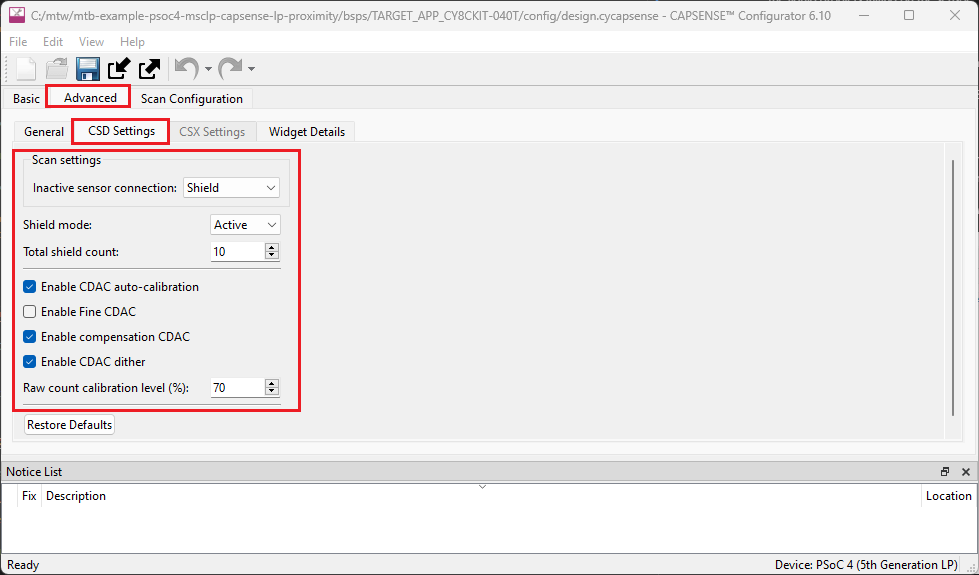

8. Go to the **Widget details** tab.


   Select **Proximity0** from the left pane, and then set the following:

   - **Sense clock divider:** Retain the default value (will be set in [Stage 3:  Set sense clock frequency](#stage-3-set-sense-clock-frequency))

   - **Clock source:** Direct

      **Note:** Spread spectrum clock (SSC) or PRS clock can be used as a clock source to deal with EMI/EMC issues.

   - **Number of sub-conversions: 60**

     60 is a good starting point to ensure a fast scan time and sufficient signal. This value will be adjusted as required in [Stage 4: Fine-tune for required SNR, power, and refresh rate](#stage-4-fine-tune-for-required-snr-power-and-refresh-rate).

   - **Proximity threshold:** 65535

      Proximity threshold is set to the maximum to avoid waking the device up from WoT mode due to touch detection; this is required to find the signal and SNR. This will be adjusted in [Stage 5: Tune threshold parameters](#stage-5-tune-threshold-parameters).
      
   - **Touch threshold:** 65535

      Touch threshold is also set to the maximum to avoid the waking up of the device from WoT.

   - **Noise threshold:** 40

   - **Negative noise threshold:** 40

   - **Low baseline reset:** 65535
     
      Low baseline reset is set to 65535, so that the baseline does not reset at all due to abnormal dips in raw count.

   - **Hysteresis:** 40

   - **ON debounce:** 3

      **Figure 18. CAPSENSE&trade; Configurator - Proximity Widget details tab under the Advanced tab**

      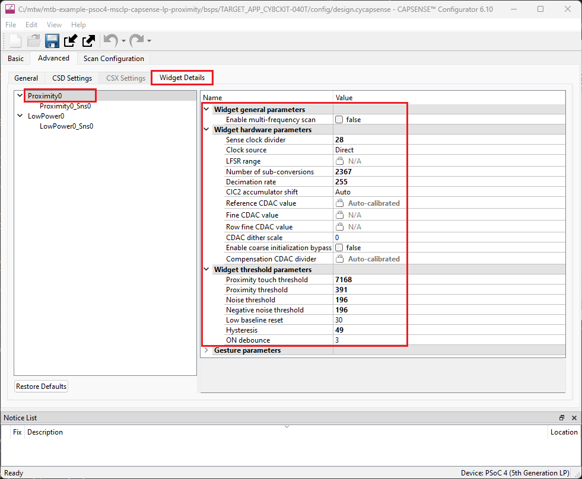

     Now, select **LowPower0** from the left pane, and then set the following:

   - **Sense clock divider:** Retain the default value (will be set in [Stage 3: Set sense clock frequency](#stage-3-set-sense-clock-frequency))

   - **Clock source:** Direct

      **Note:** Spread spectrum clock (SSC) or PRS clock can be used as the clock source to deal with EMI/EMC issues.

   - **Number of sub-conversions: 60**

     60 is a good starting point to ensure a fast scan time and sufficient signal. This value will be adjusted as required in [Stage 4: Fine-tune for required SNR, power, and refresh rate](#stage-4-fine-tune-for-required-snr-power-and-refresh-rate).

   - **Finger threshold:** 65535

      Finger threshold is set to the maximum to avoid the device waking up from WoT mode due to touch detection so that you can acquire signal for SNR measurement.

   - **Noise threshold:** 10

   - **Negative noise threshold:** 10

   - **Low baseline reset:** 10

   - **ON debounce:** 1

      **Figure 19. CAPSENSE&trade; Configurator - Low-Power Widget details tab under the Advanced tab**

     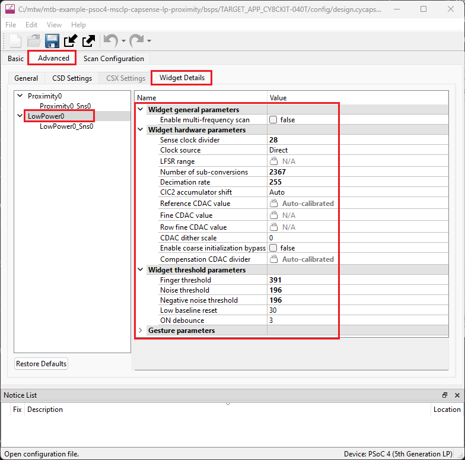

   **Note:** These values reduce the influence of the baseline on the sensor signal, which helps to get the true difference count. Retain the default values for all other threshold parameters; these parameters are set in [Stage 5: Tune threshold parameters](#stage-5-tune-threshold-parameters).

9. Go to the **Scan Configuration** tab to select the pins and scan slots. Do the following:

   1. Configure the pins for electrodes using the drop-down menu.

   2. Configure the scan slots using the **Auto-assign slots** option. The other option is to allot each sensor a scan slot based on the entered slot number.

   3. Select Proximity0_Sns0 as **Ganged** below the **LowPower0** widget, as shown in **Figure 24**.

   4. Check the notice list for warnings or errors.

      **Figure 20. Scan Configuration tab**

      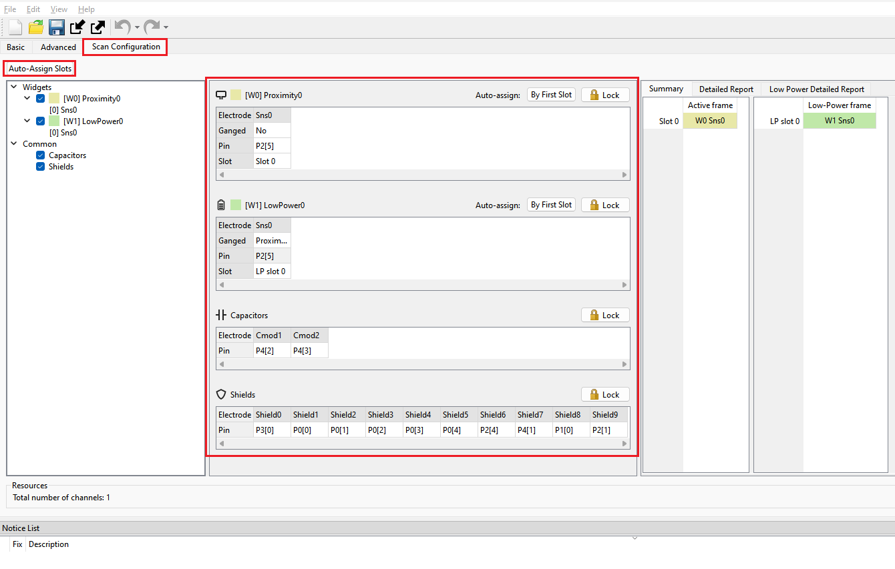

10. Click **Save** to apply the settings.

Refer to the [CAPSENSE&trade; design guide](https://www.infineon.com/AN85951) for detailed information on tuning parameters mentioned here.


### **Stage 2: Measure Sensor Capacitance and set CDAC Dither parameter**
------------------
The CAPSENSE&trade; middleware provide Built In Self Test (BIST) API's to measure the capacitances of sensors configured in the application. The sensor capacitances are referred to as  **C<sub>p</sub>** for CSD sensors and **C<sub>m</sub>** for CSX sensor.

The steps to measure the C<sub>p</sub>/C<sub>m</sub> using BIST are as follows.

   1.	Open CAPSENSE&trade; Configurator from **Quick Panel** and enable BIST library.

   **Figure 21. Enabling self test library**

   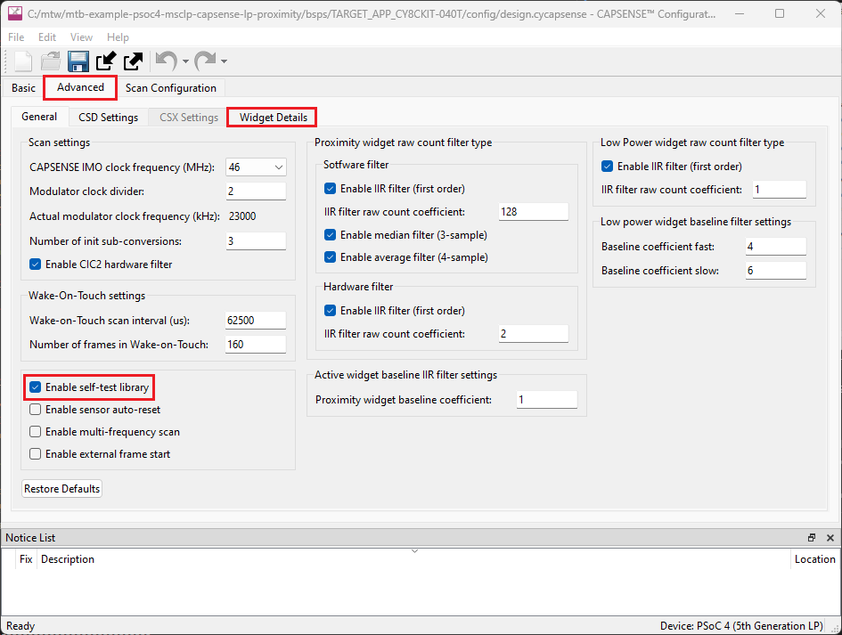


   2.	Enable  ENABLE_BIST_CP_MEASUREMENT  macro in main.c as follows,which enable Cp measurement functionality.
        ``` 
         #define    ENABLE_BIST_CP_MEASUREMENT (1u)
        ```
   3.	Get the capacitance(C<sub>p</sub>/C<sub>m</sub>) by following these steps:
        - Add breakpoint at the function call "measure_sensor_capacitance()" function in main.c
        - Run the application in debug mode
        - Click **Step over** button once break point hits
        - Add array variable sensor_capacitance to **Expressions view** tab, which holds the measured Cp values of sensors configured

   **Figure 22. Measure C<sub>p</sub>/C<sub>m</sub> using BIST**

   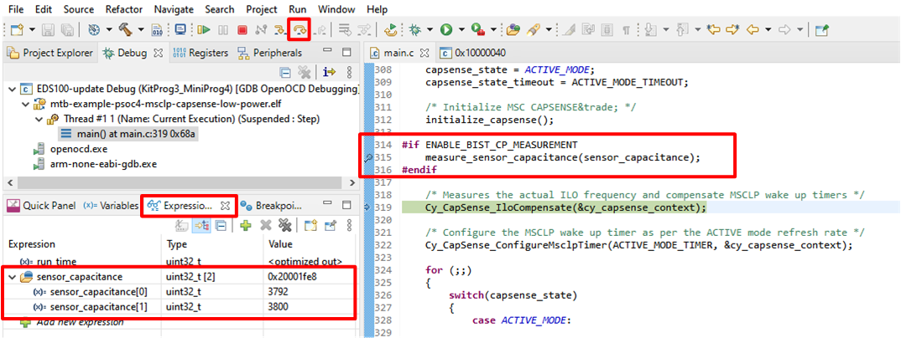

   4.	Index of sensor_capacitance array matches with the sensor configuration in CAPSENSE&trade; Configurator, as shown in **Figure 29**.

   **Figure 23. Cp array index alignment**

   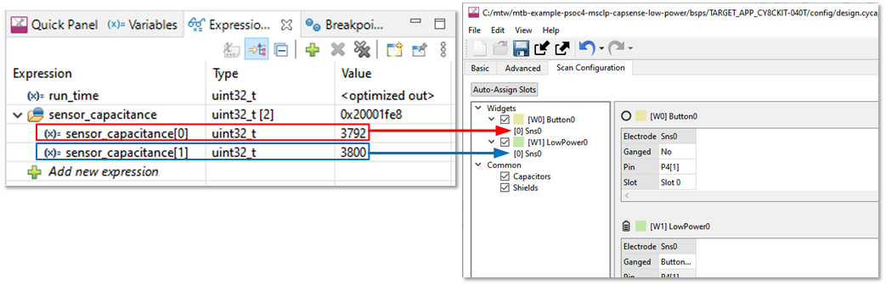

   5. Refer to [CAPSENSE&trade; library and documents](https://github.com/Infineon/capsense) for more details about BIST.
   6. Keep this feature disabled in CAPSENSE&trade; Configurator, if not used in application.

### **CDAC Dither scale setting**

MSCLP uses CDAC dithering to reduce flat spots. Select the optimal dither scale parameter based on the Sensor capacitance measured in Stage 4 Sensor Capacitance measurement.

See the following table for general recommended values of Dither scale.

   **Table 3. Dither scale recommendation for CSD sensors**

   Sensor C<sub>p</sub> range | CDAC_Dither_scale
   :---: | :---:  
   2pF <= 3pF | 3
   3pF <= 5pF | 2
   5pF <= 3pF | 1
   \>=10pF  | 0

   **Table 4. Dither scale recommendation for CSX sensors**

   Sensor C<sub>m</sub> range | CDAC_Dither_scale
   :---: | :---:  
   300fF <= 500fF | 5
   500fF <= 1000fF | 4
   1000fF <= 2000fF | 3
   \>=2pF  | Follow [Table 3](#Table-4.-Dither-Scale-Recommendation-for-CSD-Sensors)

 Set the Scale value in CAPSENSE&trade; Configurator as follows.

**Figure 24. CDAC Dither scale setting**

   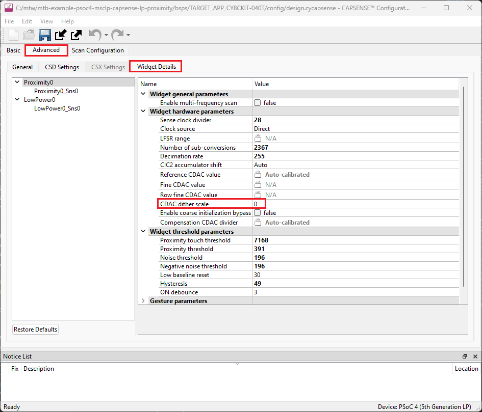

### Stage 3: Set sense clock frequency
-------------------------
The sense clock is derived from the Modulator clock using a clock-divider and is used to scan the sensor by driving the CAPSENSE&trade; switched capacitor circuits. Both the clock source and clock divider are configurable.

Select the maximum sense clock frequency such that the sensor and shield capacitance are charged and discharged completely in each cycle. This can be verified using an oscilloscope and an active probe. To view the charging and discharging waveforms of the sensor, probe at the sensor (or as close as possible to the sensors), and not at the pins or resistor. 

**Figure 25**  shows proper charging when  the sense clock frequency is correctly tuned, i.e., the voltage is settling to the required voltage at the end of each phase. **Figure 26** shows incomplete settling (charging/discharging) and hence the sense clock divider is set to 28 as shown in **Figure 25**.


   **Figure 25. Proper charge cycle of a sensor**

   

   <br>

   **Figure 26. Improper charge cycle of a sensor**

   

   To set the proper sense clock frequency, follow the steps listed below:

   1. Program the board and launch CAPSENSE&trade; Tuner.

   2. Observe the charging waveform of the sensor and shield as described earlier. 

   3. If the charging is incomplete, increase the Sense clock divider. Do this in CAPSENSE&trade; Tuner by selecting the sensor and editing the Sense clock divider parameter in the Widget/Sensor Parameters panel.

      **Note:** 
      - The sense clock divider should be **divisible by 4**. This ensures that all four scan phases have equal durations. 

      - After editing the value, click the **Apply to Device** button and observe the waveform again. Repeat this until complete settling is observed.  

      - Using a passive probe will add an additional parasitic capacitance of around 15 pF; therefore, should be considered during the tuning.

   4. Click the **Apply to Project** button so that the configuration is saved to your project. 

      **Figure 27. Sense Clock Divider setting**

      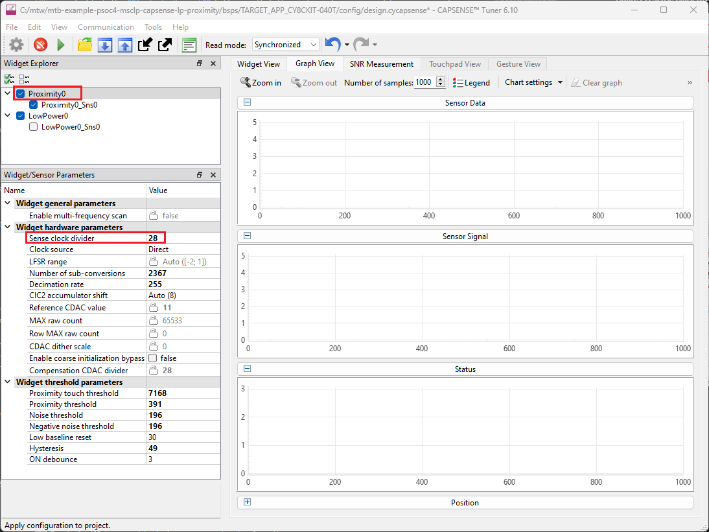
      
   5. Repeat this process for all the sensors and the shield. Each sensor may require a different sense clock divider value to charge/discharge completely. But all the sensors which are in the same scan slot need to have the same sense clock source, sense clock divider, and number of sub-conversions. Therefore, take the largest sense clock divider in a given scan slot and apply it to all the other sensors that share that slot.

      **Table 5. Sense clock parameters obtained based on sensors for Smart Lock**

      Parameter | Value |
      :-------- |:-----------|
      Modulator clock divider | 2 |
      Sense clock divider | 32 |

### Stage 4: Fine-tune for required SNR, power, and refresh rate
-------------------------
The sensor should be tuned to have a minimum SNR of 5:1 and a minimum signal of 50 to ensure reliable operation. The sensitivity can be increased by increasing number of sub-conversions, and noise can be decreased by enabling available filters. 

The steps for optimizing these parameters are as follows:

1. Measure the SNR as mentioned in the [Operation](#operation) section.

   Measure the SNR by placing your hand above the proximity loop at maximum proximity height (35 mm in this case).

2. If the SNR is less than 5:1 increase the number of sub-conversions. Edit the number of sub-conversions (N<sub>sub</sub>) directly in the **Widget/Sensor parameters** tab of the CAPSENSE&trade; Tuner.

      **Note:** Number of sub-conversion should be greater than or equal to 8.

3. PSoC&trade; 4000T CAPSENSE&trade; has a built-in CIC2 filter which increases the resolution for the same scan time. This example has the CIC2 filter enabled.

   Calculate the decimation rate of the CIC2 filter using **Equation 1**. The resolution increases with an increase in the decimation rate; therefore, set the maximum decimation rate indicated by the equation.

      **Equation 1. Decimation rate**

      

4.  Load the parameters to the device and measure SNR as mentioned in Steps 10 and 11 in the [Monitor data using CAPSENSE&trade; Tuner](#monitor-data-using-capsense™-tuner) section. 
   
      Repeat steps 1 to 4 until the following conditions are met:

      - Measured SNR from the previous stage is greater than 5:1

      - Signal count is greater than 50

5. If the system is noisy (>40% of signal), enable filters.

   Whenever the CIC2 filter is enabled, it is recommended to enable the IIR filter for optimal noise reduction. Therefore, this example has the IIR filter enabled as well.

   To enable and configure filters available in the system:

   a. Open **CAPSENSE&trade; Configurator** from ModusToolbox&trade; **Quick Panel** and select the appropriate filter:

      **Figure 28. Filter settings in CAPSENSE&trade; Configurator**

      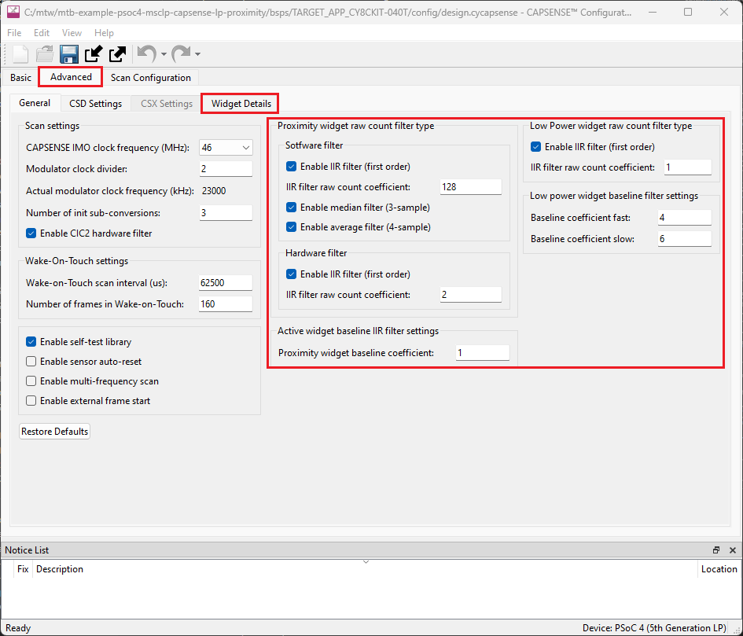

      **Note** : Add the filter based on the type of noise in your measurements. See [ModusToolbox&trade; CAPSENSE&trade; configurator guide](https://www.infineon.com/file/492896/download) for details.

   b. Click Save and close CAPSENSE&trade; Configurator. Program the device to update the filter settings.

   **Note** : Increasing number of sub-conversions and enabling filters increases the scan time which in turn decreases the responsiveness of the sensor. Increase in scan time also increases the power consumption. Therefore, the number of sub-conversions and filter configuration must be optimized to achieve a balance between SNR, power, and refresh rate. 

### Stage 5: Tune threshold parameters
-------------------------
Various thresholds, relative to the signal, need to be set for each sensor. Do the following in CAPSENSE&trade; Tuner to set up the thresholds for a widget:

1. Switch to the **Graph View** tab and select **Proximity0**.

2. Place your hand at 45 mm directly above the proximity sensor and monitor the touch signal in the **Sensor signal** graph, as shown in **Figure 29**. 

   **Figure 29. Sensor signal when hand is in the proximity of the sensor**

   

3. Note the signal measured and set the thresholds according to the following recommendations:

   - Proximity threshold = 80% of the signal

   - Proximity touch threshold = 80% of the signal

     Here, the touch threshold denotes the threshold for the proximity sensor to detect a touch when it is touched by a finger. When the proximity sensor is touched, the sensor yields a higher signal compared the proximity signal; therefore, it is the **touch signal**. To measure the touch signal count, touch the sensor and monitor the signal in the **Sensor signal** graph.

   - Noise threshold = 40% of the signal

   - Negative noise threshold = 40% of the signal

   - Hysteresis = 10% of signal

   - Low baseline reset = 65535

      Low baseline reset is set to 65535, so that the baseline does not reset at all due to abnormal dip in raw count for long time.

   - Hysteresis = 10% of the signal

   - ON debounce = 3

2. For the **LowPower0** sensor, first configure the Finger threshold to 65535 and wait for the application to enter Low Power mode. Since the Finger threshold is set to maximum, touching the low power button will not switch the application to active mode. Repeat steps 2 to 4 for the low power button.

3. Apply the settings to the device by clicking **To device**.

   **Figure 30. Apply settings to device**

   

   If your sensor is tuned correctly, you will observe that the proximity status goes from 0 to 1 in the **Status** sub-window of the **Graph View** window as **Figure 35** shows. The successful tuning of the proximity sensor is also indicated by LED3 in the kit; it turns ON when the hand comes closer than the maximum distance and turns OFF when the hand is moved away from the proximity sensor.

   **Figure 31. Sensor status in CAPSENSE&trade; Tuner showing proximity status**

   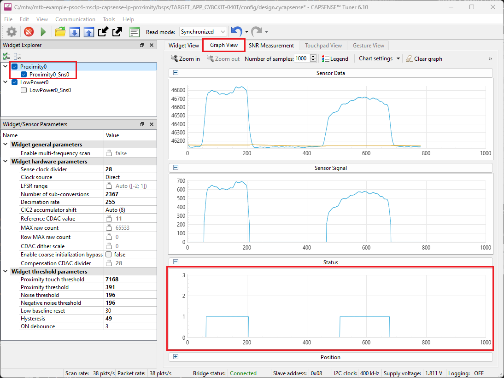

   Upon touching the proximity loop, a further change in status from 1 to 3 can be observed, which indicates a touch. Along with this, LED1 will turn ON in blue color.

   **Figure 32. Sensor status in CAPSENSE&trade; Tuner showing touch status**

   

7. Click **Apply to Project** as shown in **Figure 32**. The change is updated in the *design.cycapsense* file. 
   
   Close **CAPSENSE&trade; Tuner** and launch **CAPSENSE&trade; Configurator**. You should now see all the changes that you made in the CAPSENSE&trade; Tuner reflected in the **CAPSENSE&trade; Configurator**.

   ##### **Figure 33. Apply settings to Project**

   

   <br>

   **Table 6. Tuning parameters obtained based on sensors for Smart Lock**

   Parameter | Proximity0 | LowPower0|
   :-------- |:-----------|:---------
   Proximity signal | 750 |41 |
   Touch signal | 8960 | NA |
   Proximity threshold | 600 |33|
   Touch threshold | 7168 |NA |
   Noise threshold |200|16|
   Negative noise threshold |200 |16 |
   Low baseline reset | 65535 |30 |
   Hysteresis | 40 |NA |
   ON debounce | 3|1|

   **Note:** For the low-power widget, the touch threshold is the finger threshold.

   </details>

<br>

###  **Process time measurement**
--------------------


To set the optimum refresh rate for each power mode, measure the processing time of the application.

Follow these steps to measure the process time of the blocks of application code while excluding the scan time:

1. Enable ENABLE_RUN_TIME_MEASUREMENT macro in main.c as follows:
   
      ```
      #define ENABLE_RUN_TIME_MEASUREMENT (1u)
      ```
      This macro enables the System tick configuration and runtime measurement functionalities. 

2.	Place the start_runtime_measurement() function call before your application code and the stop_runtime_measurement() function call after it. The stop_runtime_measurement() function will return the execution time in microseconds(µs). 

      ```   
         #if ENABLE_RUN_TIME_MEASUREMENT
            uint32_t run_time = 0;
            start_runtime_measurement();
         #endif

         /* User Application Code Start */
         .
         .
         .
         /* User Application Code Stop */

         #if ENABLE_RUN_TIME_MEASUREMENT
            run_time = stop_runtime_measurement();
         #endif
      ```

3.	Run the application in debug mode with breakpoints placed at the active_processing_time and alr_processing_time variables as follows:
      ```
         #if ENABLE_RUN_TIME_MEASUREMENT
            active_processing_time = stop_runtime_measurement();
         #endif
         and 
         #if ENABLE_RUN_TIME_MEASUREMENT
            alr_processing_time = stop_runtime_measurement();
         #endif
      ```
4. Read the variables by adding them into **Expressions view** tab.
5. Update related macros with the earlier measured processing times in main.c as follows:
      ```
      #define ACTIVE_MODE_PROCESS_TIME     (xx)
      
      #define ALR_MODE_PROCESS_TIME        (xx)
      ```
### **Scan time Measurement**
--------------------
Scan time is also part of calculating the refresh rate of power modes and can be calculated as follows:

   **Equation 2. Scan time calculation of a widget**

   

A fixed duration of 30 µs is added, which is the standard initialization time taken before each scan.

Update the following macros in main.c using the scan time calculated. The value remains the same for both macros.

```
#define ACTIVE_MODE_FRAME_SCAN_TIME     (xx)

#define ALR_MODE_FRAME_SCAN_TIME        (xx)
```

**Note :** If the application has more than one widget, add the scan times of individual widgets calculated.

<br>

## Debugging

You can debug the example to step through the code. In the IDE, use the **\<Application Name> Debug (KitProg3_MiniProg4)** configuration in the **Quick Panel**. For details, see the "Program and debug" section in the [Eclipse IDE for ModusToolbox&trade; user guide](https://www.infineon.com/MTBEclipseIDEUserGuide).

<br>

## Design and implementation

The project contains the following widgets:

1. Proximity widget with 1 electrode configured in CSD-RM sensing mode.

2. Low power widget with 1 electrode configured in CSD-RM sensing mode
See the [Tuning procedure](#tuning-procedure) section for step-by-step instructions on configuring these widgets.
<br>

The project uses the [CAPSENSE&trade; middleware](https://infineon.github.io/capsense/capsense_api_reference_manual/html/index.html); see the [ModusToolbox&trade; software user guide](https://www.infineon.com/ModusToolboxUserGuide) for more details on selecting a middleware.

See [AN85951 – PSoC&trade; 4 and PSoC&trade; 6 MCU CAPSENSE&trade; design guide](https://www.infineon.com/an85951) for more details of CAPSENSE&trade; features and usage.

The design also has an EZI2C peripheral and a SPI master peripheral. The EZI2C slave peripheral is used to monitor the information of sensor raw and processed data on a PC using the CAPSENSE&trade; Tuner available in the Eclipse IDE for ModusToolbox&trade; via I2C communication.

The MOSI pin of the SPI slave peripheral is used to transfer data to the three serially connected LEDs for controlling color, brightness, and ON/OFF operation.

The firmware is designed to support the following application states:

- Active state
- Active low-refresh rate (ALR) state
- Wake-on-touch (WOT) state

   **Figure 34. Firmware state-machine**

   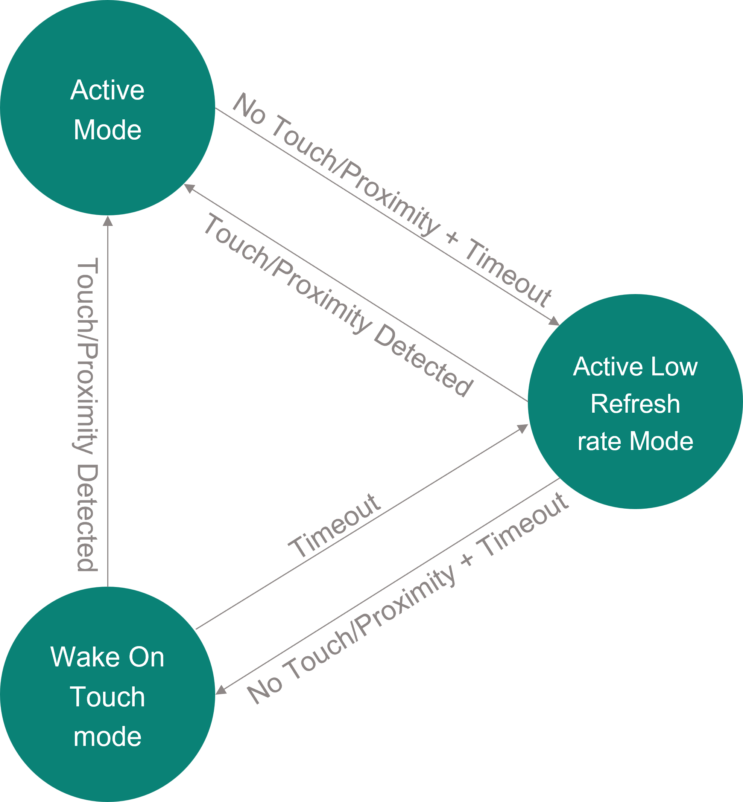

   <br>

The firmware state machine and the operation of the device in four different states are explained in the following steps:

1. Initializes and starts all hardware components after reset.

2. The device starts CAPSENSE&trade; operation in the Active state. In this state, the following steps occur:

   1. The device scans all CAPSENSE&trade; sensors present on the board.

   2. During the ongoing scan operation, the CPU moves to the Deep Sleep state.

   3. The interrupt generated on scan completion wakes the CPU, which processes the sensor data and transfers the data to CAPSENSE&trade; Tuner through EZI2C.

   4. Turn ON the serial LED with specific colors and patterns to indicate the specific proximity or touch detection.

   In Active state, a scan of the selected sensors happen with the highest refresh rate of 128 Hz.

3. Enters the Active low-refresh rate state when there is no touch or object in proximity detected for a timeout period. In this state, selected sensors are scanned with a lower refresh rate of 32 Hz. Because of this, power consumption in the Active low-refresh rate state is lower compared to the Active state. The state machine returns to the Active state if there is touch or object in proximity detected by the sensor.

4. Enters the Wake-on-touch state when there is no touch or object in proximity detected in Active low-refresh rate state for a timeout period. In this state, the CPU is set to deep sleep, and is not involved in CAPSENSE&trade; operation. This is the lowest power state of the device. In the Wake-on-touch state, the CAPSENSE&trade; hardware executes the scanning of the selected sensors called "low-power widgets" and processes the scan data for these widgets. If touch is detected, the CAPSENSE&trade; block wakes up the CPU and the device enters to the Active state.

There are three onboard RGB LEDs connected to the SPI MOSI pin of the device. These LEDs form a daisy-chain connection and communicate over the serial interface. The LEDs accept a 32-bit input code, with three bytes for red, green, and blue colors, five bits for global brightness, and three blank '1' bits. See the [LED datasheet](https://media.digikey.com/pdf/Data%20Sheets/Everlight%20PDFs/12-23C_RSGHBHW-5V01_2C_Rev4_12-17-18.pdf) for more details.

### Firmware flow

**Figure 35. Firmware flowchart**

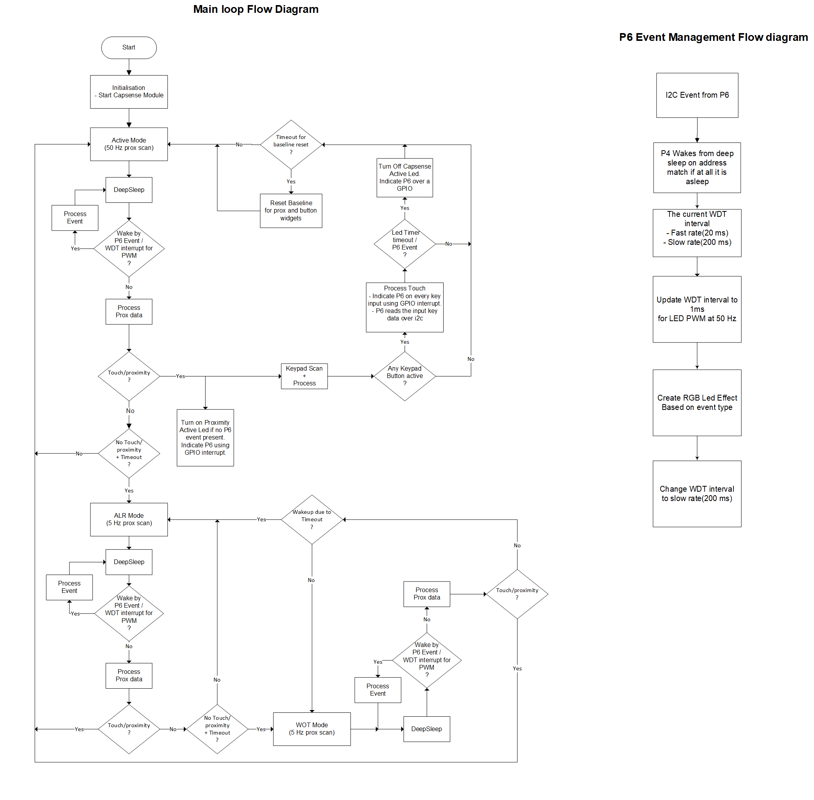

<br>

### Set up the VDDA supply voltage and debug mode in Device Configurator

1. Open Device Configurator from the **Quick Panel**.

2. Go to the **System** tab. Select the **Power** resource, and set the VDDA value under **Operating conditions** as follows:

   **Figure 36. Setting the VDDA supply in the System tab of Device Configurator**

   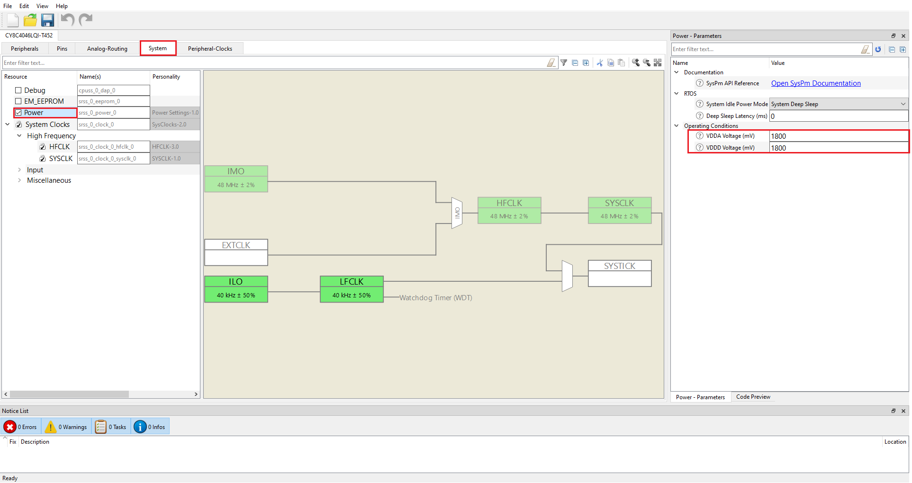

3. By default, SWD pins are active in all device power modes. Disable debug mode to disable SWD pins and thereby reduce the power consumption as follows:

   **Figure 37. Disable Debug mode in the System tab of Device Configurator**

   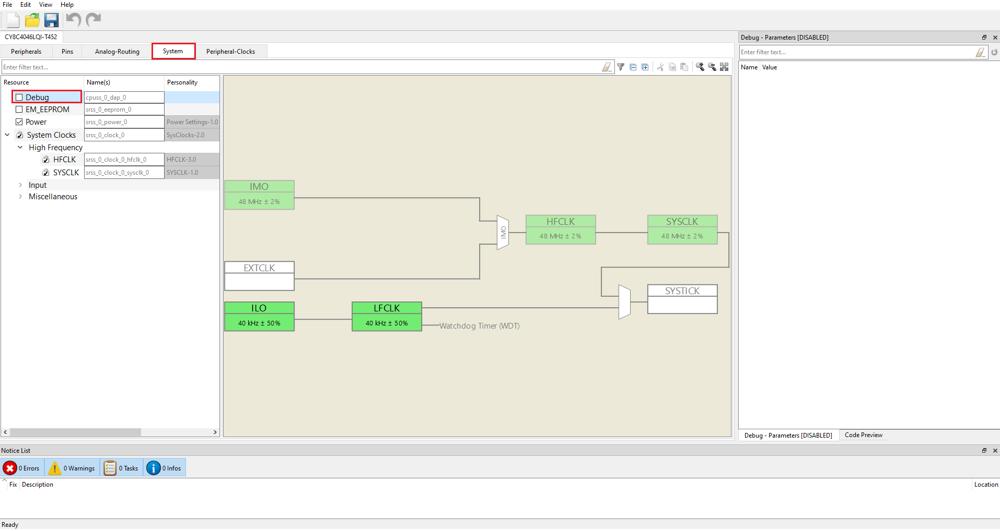


### Resources and settings

**Figure 38. EZI2C settings**

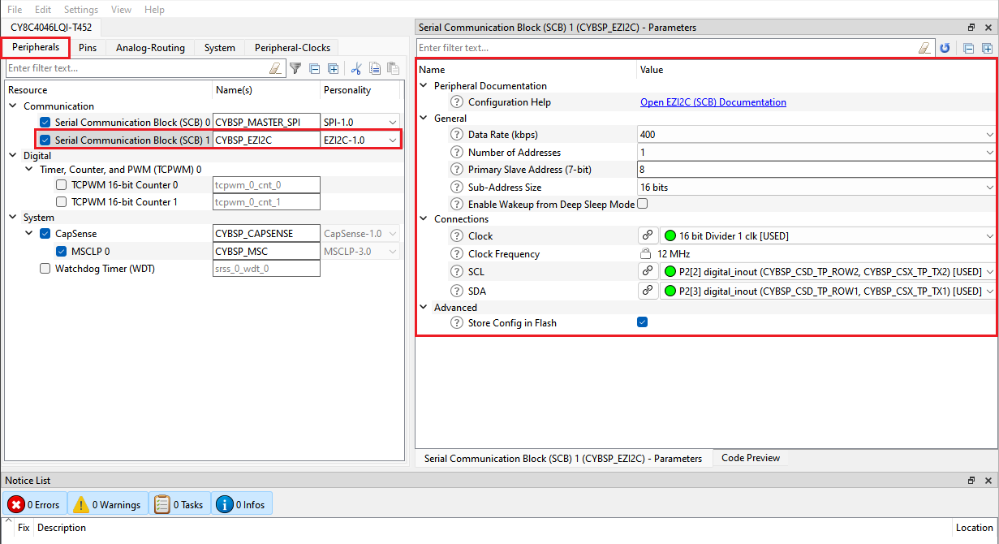

**Figure 39. SPI settings**

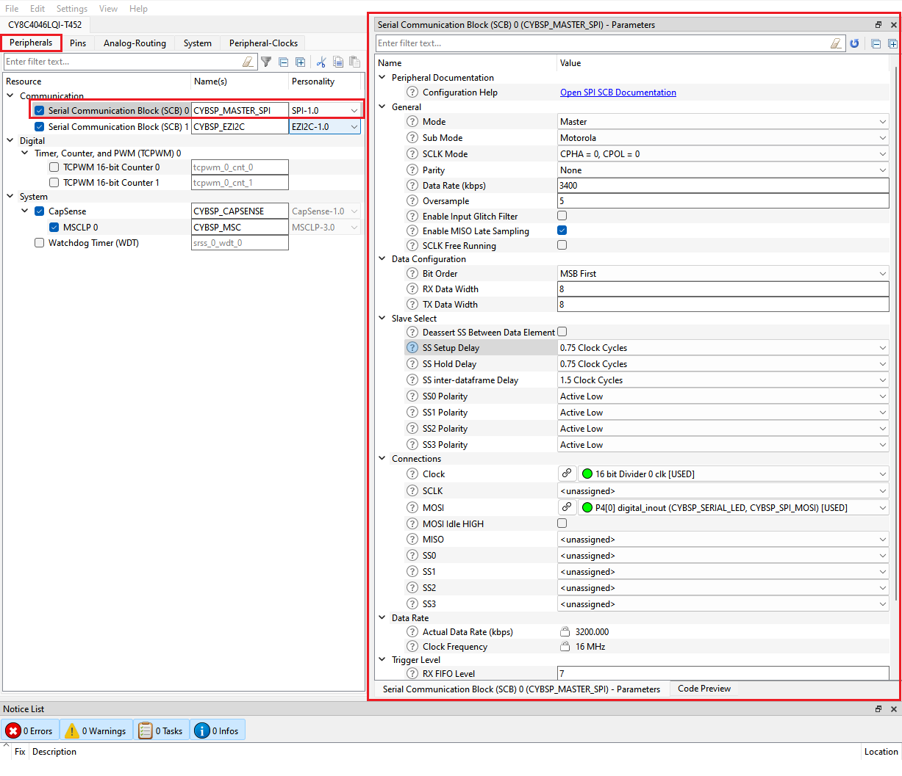

**Table 7. Application resources**

 Resource  |  Alias/object     |    Purpose     |
 :------- | :------------    | :------------ |
 SCB (I2C) (PDL) | CYBSP_EZI2C          | EZI2C slave driver to communicate with CAPSENSE&trade; Tuner |
 SCB (SPI) (PDL) | CYBSP_MASTER_SPI          | SPI master driver to control serial LEDs |
 CAPSENSE&trade; | CYBSP_MSC | CAPSENSE&trade; driver to interact with the MSC hardware and interface the CAPSENSE&trade; sensors |
 Digital pin | CYBSP_SERIAL_LED | To show the proximity operation and power mode states|

</details>

<br>

## Related resources

Resources  | Links
-----------|----------------------------------
Application notes  | [AN79953](https://www.infineon.com/dgdl/Infineon-AN79953_Getting_Started_with_PSoC_4-ApplicationNotes-v21_00-EN.pdf?fileId=8ac78c8c7cdc391c017d07271fd64bc1) – Getting started with PSoC&trade; 4 <br> [AN85951](https://www.infineon.com/AN85951) – PSoC&trade; 4 and PSoC&trade; 6 MCU CAPSENSE&trade; design guide <br> [AN234231](https://www.infineon.com/002-34231) – Achieving lowest-power capacitive sensing with PSoC&trade; 4000T <br> [AN92239](https://www.cypress.com/AN92239) – Proximity Sensing with CAPSENSE&trade;
Code examples  | [Using ModusToolbox&trade;](https://github.com/Infineon/Code-Examples-for-ModusToolbox-Software) on GitHub
Device documentation | [PSoC&trade; 4 datasheets](https://www.infineon.com/cms/en/search.html#!view=downloads&term=psoc4&doc_group=Data%20Sheet) <br>[PSoC&trade; 4 technical reference manuals](https://www.infineon.com/cms/en/search.html#!view=downloads&term=psoc4&doc_group=Additional%20Technical%20Information)
Development kits | Select your kits from the [Evaluation board finder](https://www.infineon.com/cms/en/design-support/finder-selection-tools/product-finder/evaluation-board).
Libraries on GitHub  | [mtb-pdl-cat2](https://github.com/Infineon/mtb-pdl-cat2) – PSoC&trade; 4 Peripheral Driver Library (PDL) <br>  [mtb-hal-cat2](https://github.com/Infineon/mtb-hal-cat2) – Hardware Abstraction Layer (HAL) library
Middleware on GitHub  | [capsense](https://github.com/Infineon/capsense) – CAPSENSE&trade; library and documents <br> [psoc4-middleware](https://github.com/Infineon/psoc4-middleware) – Links to all PSoC&trade; 4 middleware
Tools | [Eclipse IDE for ModusToolbox&trade;](https://www.infineon.com/modustoolbox) – ModusToolbox&trade; is a collection of easy-to-use software and tools enabling rapid development with Infineon MCUs, covering applications from embedded sense and control to wireless and cloud-connected systems using AIROC&trade; Wi-Fi and Bluetooth&reg; connectivity devices.

<br>

## Other resources

Infineon provides a wealth of data at www.infineon.com to help you select the right device, and quickly and effectively integrate it into your design.

## Document history

Document title: *Infineon Smart Lock - Touch application*

| Version | Description of change                                        |
| ------- | ------------------------------------------------------------ |
| 0.1.0   | New code example for Smart Lock using PSoC 4000T |
| 0.1.1   | Added UART debug log support |
| 0.1.2   | Bringup firmware for Button type sensors with BIST and Runtime measurement |
| 0.1.3   | Replacing button type sensors with Matrix button type sensor for keypress detection |
| 0.1.4   | Added prox ON and OFF I2C messages to P6 using Host INTR pin toggle |
| 0.2.0   | Enabling 500Hz software PWM for RGB LED indications |
| 0.3.0   | Reducing PWM frequency from 500Hz to 50Hz for reducing wakeup interval and power consumption |
| 0.3.1   | Disabling baseline update for keypad when proximity activated to improve sensitivity |
| 0.4.0   | Reducing the max dutycycle of LED PWM from 100% to 20% for reducing power consumption |
| 0.4.1   | Updating CPU frequency from 24Mhz to 32Mhz for optimal performance and power consumption |
| 0.5.0   | Changing sensor type of keypad from matrix button widget to button sensors for individual tuning and better touch detection using signal comparison when multiple sensors are active |
| 0.5.1   | Enabling SW filters for increasing SNR to above 10 |
| 0.5.2   | Updating capsense IMO clock from 23Mhz to 46Mhz for reducing power consumption |
| 0.6.0   | Updating code to do baseline reset for only prox widget instead of all widgets to avoid keypad performance getting affected. Increased the PWM step size for LED fading to reduce visible stepping effect. |
| 0.6.1   | Updating LED indication for NFC provisioning to 30s, pairing mode event indication inbetween will be blocked. Added Macro for enabling SNR measurement. |
| 0.6.2   | Updating Readme and release version. Updating LED blink patterns. |

 <br>

---------------------------------------------------------

© Cypress Semiconductor Corporation, 2023. This document is the property of Cypress Semiconductor Corporation, an Infineon Technologies company, and its affiliates ("Cypress").  This document, including any software or firmware included or referenced in this document ("Software"), is owned by Cypress under the intellectual property laws and treaties of the United States and other countries worldwide.  Cypress reserves all rights under such laws and treaties and does not, except as specifically stated in this paragraph, grant any license under its patents, copyrights, trademarks, or other intellectual property rights.  If the Software is not accompanied by a license agreement and you do not otherwise have a written agreement with Cypress governing the use of the Software, then Cypress hereby grants you a personal, non-exclusive, nontransferable license (without the right to sublicense) (1) under its copyright rights in the Software (a) for Software provided in source code form, to modify and reproduce the Software solely for use with Cypress hardware products, only internally within your organization, and (b) to distribute the Software in binary code form externally to end users (either directly or indirectly through resellers and distributors), solely for use on Cypress hardware product units, and (2) under those claims of Cypress’s patents that are infringed by the Software (as provided by Cypress, unmodified) to make, use, distribute, and import the Software solely for use with Cypress hardware products.  Any other use, reproduction, modification, translation, or compilation of the Software is prohibited.
<br>
TO THE EXTENT PERMITTED BY APPLICABLE LAW, CYPRESS MAKES NO WARRANTY OF ANY KIND, EXPRESS OR IMPLIED, WITH REGARD TO THIS DOCUMENT OR ANY SOFTWARE OR ACCOMPANYING HARDWARE, INCLUDING, BUT NOT LIMITED TO, THE IMPLIED WARRANTIES OF MERCHANTABILITY AND FITNESS FOR A PARTICULAR PURPOSE.  No computing device can be absolutely secure.  Therefore, despite security measures implemented in Cypress hardware or software products, Cypress shall have no liability arising out of any security breach, such as unauthorized access to or use of a Cypress product. CYPRESS DOES NOT REPRESENT, WARRANT, OR GUARANTEE THAT CYPRESS PRODUCTS, OR SYSTEMS CREATED USING CYPRESS PRODUCTS, WILL BE FREE FROM CORRUPTION, ATTACK, VIRUSES, INTERFERENCE, HACKING, DATA LOSS OR THEFT, OR OTHER SECURITY INTRUSION (collectively, "Security Breach").  Cypress disclaims any liability relating to any Security Breach, and you shall and hereby do release Cypress from any claim, damage, or other liability arising from any Security Breach.  In addition, the products described in these materials may contain design defects or errors known as errata which may cause the product to deviate from published specifications. To the extent permitted by applicable law, Cypress reserves the right to make changes to this document without further notice. Cypress does not assume any liability arising out of the application or use of any product or circuit described in this document. Any information provided in this document, including any sample design information or programming code, is provided only for reference purposes.  It is the responsibility of the user of this document to properly design, program, and test the functionality and safety of any application made of this information and any resulting product.  "High-Risk Device" means any device or system whose failure could cause personal injury, death, or property damage.  Examples of High-Risk Devices are weapons, nuclear installations, surgical implants, and other medical devices.  "Critical Component" means any component of a High-Risk Device whose failure to perform can be reasonably expected to cause, directly or indirectly, the failure of the High-Risk Device, or to affect its safety or effectiveness.  Cypress is not liable, in whole or in part, and you shall and hereby do release Cypress from any claim, damage, or other liability arising from any use of a Cypress product as a Critical Component in a High-Risk Device. You shall indemnify and hold Cypress, including its affiliates, and its directors, officers, employees, agents, distributors, and assigns harmless from and against all claims, costs, damages, and expenses, arising out of any claim, including claims for product liability, personal injury or death, or property damage arising from any use of a Cypress product as a Critical Component in a High-Risk Device. Cypress products are not intended or authorized for use as a Critical Component in any High-Risk Device except to the limited extent that (i) Cypress’s published data sheet for the product explicitly states Cypress has qualified the product for use in a specific High-Risk Device, or (ii) Cypress has given you advance written authorization to use the product as a Critical Component in the specific High-Risk Device and you have signed a separate indemnification agreement.
<br>
Cypress, the Cypress logo, and combinations thereof, WICED, ModusToolbox, PSoC, CapSense, EZ-USB, F-RAM, and Traveo are trademarks or registered trademarks of Cypress or a subsidiary of Cypress in the United States or in other countries. For a more complete list of Cypress trademarks, visit www.infineon.com. Other names and brands may be claimed as property of their respective owners.
